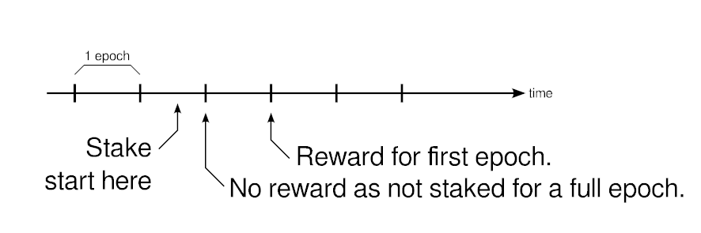
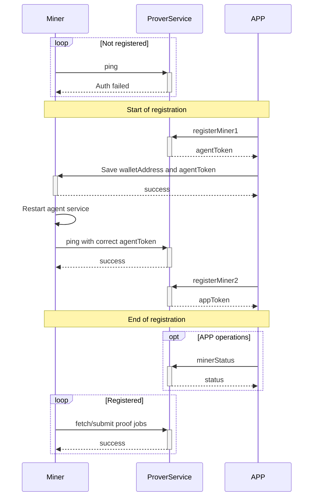

# Moonchain ZK Lite Paper


## Block diagram


### APP

A mobile application for participants (end users).

### Proxy Service

A back-end service responsible for miner registration. It also analyses miner status and forwards the results to the staking contract.

### mxc-prover-service

A back-end service includes the prover manager and the Taiko-client-prover. It is responsible for SGX proof generation for miners, miner registration, and miner data analysis for penalty issuance.

### sgx-prover

A service running on the miner that retrieves jobs from the back end, generates SGX proofs, and submits them back.

### Staking Contract

An L1 contract on the Arbitrum chain that manages the entire staking process.


## Staking (miner owner)

A participant needs one miner (SGX prover) and a certain amount of MXC staked in the Moonchain L1 staking contract. After the staking period, the participant can claim a reward. 

**[!!Request for Comment:]** A participant using two or more miners with a single wallet will not affect the reward. The advantage of having additional miners is that they can act as backups—if one miner goes down, the others can continue operating, preventing penalties.


## Staking (without miner)

For those who wish to participate without owning a miner, they can delegate their stake to a miner owner. This delegation results in the reward being split, with 20% going to the miner owner and 80% going to the staking participant.

However, if a penalty is incurred, it will affect both the staking participant and the miner owner. Therefore, it is essential to choose a reliable miner owner when participating.


## Staking Period (a Epoch)

A staking period, known as an epoch, lasts for seven days and aligns with every Thursday at 00:00 UTC. Rewards are calculated based on the number of epochs the amount has been staked.




## Penalty


#### Reward Reduction

If a miner's performance falls short of expectations, a penalty will be imposed on the associated participants—namely, the owner and those who have staked on the owner. As a result, the reward for one epoch will be reduced.

Penalty Condition (at the time of checking):

- The online time has not reached 85% in the past seven days.


#### Slash of staked amount

When a miner performing actions that harm the network, the staked amount linked to the miner will be slash. 

List of harmful actions:

- Submission of an Invalid Proof.
  A miner submitting an invalid proof, which will be rejected by the L1 contract.
- Failure of Three Consecutive SGX Generation Jobs.
  **[!! To be changed]** Preliminary observations indicate that Raiko fails for unknown reasons, leaving it in an indeterminate state. Further investigation is required to resolve this issue before this penalty are applied.


## Reward

Rewards are calculated using an approximate 10% annual percentage rate (APR) applied to the total staked MXC. They are then distributed based on each participant's staking weight and overall pledge duration (measured in epochs).


## Participating

Here’s an example workflow for participating in staking:

1. Purchase a miner.
2. Use the APP to create a wallet.
3. Connect to the miner via Bluetooth using the app.
4. Retrieve the SGX instance ID and save the wallet address to the miner.
5. Call the API on the Proxy Service to register the miner with the wallet address and SGX instance ID.
6. Interact with the L1 Staking Contract to stake an amount of MXC.

After staking, periodically call the L1 Staking Contract to claim rewards.


## Staking Contract

Mainnet Address: TBD

Testnet Address: TBD


#### function stake(address _user, uint256 _amount)

Deposits MXC token to be used as bonds.

_user: The user address to credit.

_amount: The amount of token to deposit.


#### function stakingRequestWithdrawal(bool cancel)

Request a withdrawal. It will start the lock period.

cancel: Set to true for cancelling any previous request.


#### function stakingWithdrawal() 

User completes the withdrawal after the lock period.


#### function stakingClaimReward()

User claims their accumulated interest and transfers it to their wallet.


## Prover Service (back-end server) APIs for APP

Mainnet base URL: https://prover-manager.moonchain.com/

Testnet base URL: https://geneva-prover-manager.moonchain.com/


#### POST `/app/registerMiner1`

This is the first step of the miner registration. Call this with the created wallet address to start the process. A `agentToken` will return. The APP must send the wallet address and `agentToken` to the miner, then the miner will use this information to verify itself with the Prover Service.

Example POST data:

```
{
  "instanceId": 0,
  "walletAddress": "0x0123456789ABCDEF0123456789ABCDEF01234567"
}
```

Example response:

```
{
  "ret": 0,
  "message": "",
  "result": {
    "agentToken": "VZ/NkCa4I0WCzO9SW9HCx6fzgOYLpyXMC/uTqxG+qFA="
  }
}
```


#### POST `/app/registerMiner2`

This is the second step of the registration. After the miner verify itself with the `agentToken` got from step 1, this step will be success and returned a `appToken`. The `appToken` will be used to query the miner status later on.

Example POST data:

```
{
  "instanceId": 0
}
```

Example response (miner not verify yet):

```
{
  "ret": 0,
  "message": "Wait for miner.",
  "result": {
    "appToken": "",
	"waitForMiner": true
  }
}
```

Example response (miner verified):

```
{
  "ret": 0,
  "message": "",
  "result": {
    "appToken": "K6P1QE7Az6Qh8JmPFjgR1XhG9bbzWviO1zKMhWN2FyU",
	"waitForMiner": false  
  }
}
```


#### GET `/app/minerStatus/<INSTANCE_ID>`

Get the status of a miner.

Auth header:

```
"Authorization" : "Bearer <APP_TOKEN>"
```

Example response:

```
{
  "ret": 0,
  "message": "",
  "result": {
    "lastPing": "2025-02-10T15:01:34.000Z",
    "online": {"value": 1, "timestamp": "2025-02-10T15:00:00Z"},
    "proofReceived": {"value": 22, "timestamp": "2025-02-10T15:00:00Z"},
    "proofRejected": {"value": 15, "timestamp": "2025-02-10T15:00:00Z"}
  }
}
```

*"online", "proofReceived", "proofRejected" are statistic result of past 1 hour data.*


#### GET `/app/minerStatistic/<INSTANCE_ID>/<ITEM>/[daily]`

Retrieve a miner's statistical data. The `ITEM` parameter can be one of the following: `"online"`, `"proofReceived"`, or `"proofRejected"`. Additionally, the optional `daily` parameter returns data aggregated on a daily basis; if omitted, the data will be aggregated on a 7  days (1 epoch) basis.

Auth header:

```
"Authorization" : "Bearer <APP_TOKEN>"
```

Example response:

```
{
  "ret": 0,
  "message": "",
  "result": {
    "item": "proofReceived",
    "data": [
      {"value": 0, "timestamp": "2024-12-05T00:00:00Z"},
      {"value": 0, "timestamp": "2024-12-12T00:00:00Z"},
      {"value": 0, "timestamp": "2024-12-19T00:00:00Z"},
      {"value": 0, "timestamp": "2024-12-26T00:00:00Z"},
      {"value": 0, "timestamp": "2025-01-02T00:00:00Z"},
      {"value": 0, "timestamp": "2025-01-09T00:00:00Z"},
      {"value": 0, "timestamp": "2025-01-16T00:00:00Z"},
      {"value": 0, "timestamp": "2025-01-23T00:00:00Z"},
      {"value": 0, "timestamp": "2025-01-30T00:00:00Z"},
      {"value": 0, "timestamp": "2025-02-06T00:00:00Z"},
      {"value": 114,"timestamp": "2025-02-13T00:00:00Z"}
    ]
  }
}
```


## Miner Registration Flow



